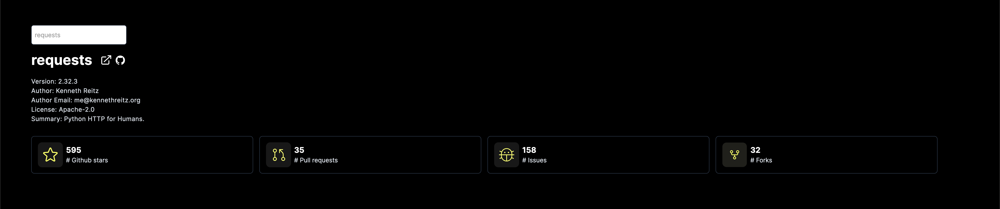
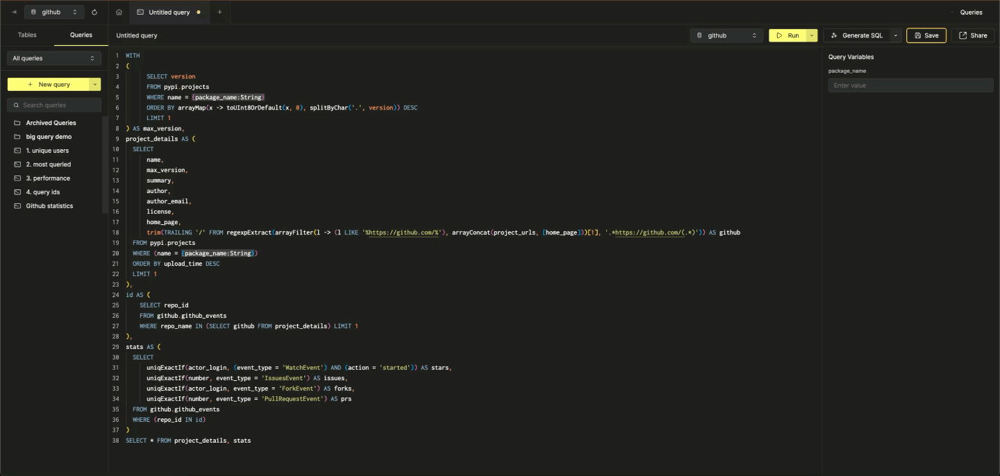

# Github Stats Demo powered by ClickHouse



This repository provides a simple application to show off ClickHouse Cloud query endpoints by allowing users to search for any Python package and retrieve Github statistics. This uses over 7.5 billion rows in ClickHouse, thus demonstrating real-time analytics on large datasets.

For the accompanying blog post see [Adding Analytics to an Application in under 10 minutes with ClickHouse and Query Endpoints](https://clickhouse.com/blog/adding-analytics-to-an-application-in-under-10-minutes-with-ClickHouse-and-query-endpoints)

If you prefer to watch a video showing the steps to build this application, watch below:

// INSERT


## Pre-requisites

* `>=` node v20.9.0

## 1. Getting started

Users can either sign up to a ClickHouse Cloud account or use the endpoint below to query the public [ClickPy](https://clickpy.clickhouse.com) service. This applies quotas.

```bash
curl -H "Content-Type: application/json" -X 'POST' -s --user 'MdhWYPEpXaqiwGMjbXWT:4b1dKbabyQTvuKUWOnI08oXVbUD4tkaxKKjEwz7ORG' 'https://console-api.clickhouse.cloud/.api/query-endpoints/297797b1-c5b0-4741-9f5b-3d6456a9860d/run?format=JSONEachRow' --data-raw '{"queryVariables":{"package_name":"requests"}}'
```

If you using the public endpoint, skip to step (6) and run the app.

### 2. Signup to ClickHouse Cloud

To reproduce this demo with your own cluster, requires a ClickHouse Cloud account. Users can sign up [here](https://clickhouse.cloud/signup) and receive $300 of free credits - more than sufficient for this demo.

### 3. Load the dataset

Create the supporting databases and tables for this demo:

```sql
CREATE DATABASE pypi
CREATE TABLE pypi.projects
(
    `metadata_version` String,
    `name` String,
    `version` String,
    `summary` String,
    `description` String,
    `description_content_type` String,
    `author` String,
    `author_email` String,
    `maintainer` String,
    `maintainer_email` String,
    `license` String,
    `keywords` String,
    `classifiers` Array(String),
    `platform` Array(String),
    `home_page` String,
    `download_url` String,
    `requires_python` String,
    `requires` Array(String),
    `provides` Array(String),
    `obsoletes` Array(String),
    `requires_dist` Array(String),
    `provides_dist` Array(String),
    `obsoletes_dist` Array(String),
    `requires_external` Array(String),
    `project_urls` Array(String),
    `uploaded_via` String,
    `upload_time` DateTime64(3),
    `filename` String,
    `size` Int64,
    `path` String,
    `python_version` String,
    `packagetype` String,
    `comment_text` String,
    `has_signature` Bool,
    `md5_digest` String,
    `sha256_digest` String,
    `blake2_256_digest` String
)
ENGINE = MergeTree
ORDER BY name

CREATE DATABASE github
CREATE TABLE github.github_events
(
    `event_type` Enum8('CommitCommentEvent' = 1, 'CreateEvent' = 2, 'DeleteEvent' = 3, 'ForkEvent' = 4, 'GollumEvent' = 5, 'IssueCommentEvent' = 6, 'IssuesEvent' = 7, 'MemberEvent' = 8, 'PublicEvent' = 9, 'PullRequestEvent' = 10, 'PullRequestReviewCommentEvent' = 11, 'PushEvent' = 12, 'ReleaseEvent' = 13, 'SponsorshipEvent' = 14, 'WatchEvent' = 15, 'GistEvent' = 16, 'FollowEvent' = 17, 'DownloadEvent' = 18, 'PullRequestReviewEvent' = 19, 'ForkApplyEvent' = 20, 'Event' = 21, 'TeamAddEvent' = 22),
    `actor_login` LowCardinality(String),
    `repo_name` LowCardinality(String),
    `repo_id` LowCardinality(String),
    `created_at` DateTime,
    `updated_at` DateTime,
    `action` Enum8('none' = 0, 'created' = 1, 'added' = 2, 'edited' = 3, 'deleted' = 4, 'opened' = 5, 'closed' = 6, 'reopened' = 7, 'assigned' = 8, 'unassigned' = 9, 'labeled' = 10, 'unlabeled' = 11, 'review_requested' = 12, 'review_request_removed' = 13, 'synchronize' = 14, 'started' = 15, 'published' = 16, 'update' = 17, 'create' = 18, 'fork' = 19, 'merged' = 20)
)
ENGINE = MergeTree
ORDER BY (repo_id, event_type, created_at)
```

Load the dataset for each table. This data is up to date as of `06/09/2024`:

```sql
INSERT INTO pypi.projects SELECT *
FROM s3('https://datasets-documentation.s3.eu-west-3.amazonaws.com/pypi/projects/projects.parquet')

0 rows in set. Elapsed: 100.277 sec. Processed 13.19 million rows, 10.83 GB (131.58 thousand rows/s., 107.97 MB/s.)

INSERT INTO github.github_events_v2 SELECT * FROM s3('https://datasets-documentation.s3.eu-west-3.amazonaws.com/github_issues/subset/github_events_*.parquet')

```

The github events dataset is quite large at almost 100 GB. Users can target subsets by year e.g. 

```sql
SELECT *
FROM s3Cluster('default', 'https://datasets-documentation.s3.eu-west-3.amazonaws.com/github_issues/subset/github_events_2024.parquet')
SETTINGS parallel_distributed_insert_select = 2

0 rows in set. Elapsed: 296.479 sec. Processed 1.23 billion rows, 13.38 GB (4.15 million rows/s., 45.14 MB/s.)
```

> Users can use [ClickPipes](https://clickhouse.com/cloud/clickpipes) to load this dataset. 

### 4. Create a query endpoint

Save the following query in ClickHouse Cloud SQL console and create an endpoint with a Query Endpoints API token. Ensure you apply the readonly role to your endpoint

**Note down the the credentials for the token and subsequent HTTP endpoint.**

```sql
WITH
(
      SELECT version
      FROM pypi.projects
      WHERE name = {package_name:String}
      ORDER BY arrayMap(x -> toUInt8OrDefault(x, 0), splitByChar('.', version)) DESC
      LIMIT 1
) AS max_version,
project_details AS (
  SELECT
      name,
      max_version,
      summary,
      author,
      author_email,
      license,
      home_page,
      trim(TRAILING '/' FROM regexpExtract(arrayFilter(l -> (l LIKE '%https://github.com/%'), arrayConcat(project_urls, [home_page]))[1], '.*https://github.com/(.*)')) AS github
  FROM pypi.projects
  WHERE (name = {package_name:String})
  ORDER BY upload_time DESC
  LIMIT 1
),
id AS (
    SELECT repo_id
    FROM github.github_events
    WHERE repo_name IN (SELECT github FROM project_details) LIMIT 1
),
stats AS (
  SELECT
      uniqExactIf(actor_login, (event_type = 'WatchEvent') AND (action = 'started')) AS stars,
      uniqExactIf(number, event_type = 'IssuesEvent') AS issues,
      uniqExactIf(actor_login, event_type = 'ForkEvent') AS forks,
      uniqExactIf(number, event_type = 'PullRequestEvent') AS prs
  FROM github.github_events
  WHERE (repo_id IN id)
)
SELECT * FROM project_details, stats
```



### 5. Update local credentials

Update the file `.env` in the root folder. Populate with the endpoint and API statistics recorded above e.g.

```bash
API_KEY_ID=MdhWYPEpXaqiwGMjbXWT
API_KEY_SECRET=4b1dKbabyQTvuKUWOnI08oXVbUD4tkaxKKjEwz7ORG
GITHUB_STATS_API=https://console-api.clickhouse.cloud/.api/query-endpoints/0b39f27a-795d-4c3c-a837-cade98e1d51f/run
```

### 6. Running the app

Run the development server:

```bash
npm run dev
# or
yarn dev
# or
pnpm dev
# or
bun dev
```

Open [http://localhost:3000](http://localhost:3000) and search for a Python package.

## Deploy on Vercel

The easiest way to deploy this app is to use the [Vercel Platform](https://vercel.com/new?utm_medium=default-template&filter=next.js&utm_source=create-next-app&utm_campaign=create-next-app-readme) from the creators of Next.js.

Check out our [Next.js deployment documentation](https://nextjs.org/docs/deployment) for more details.
